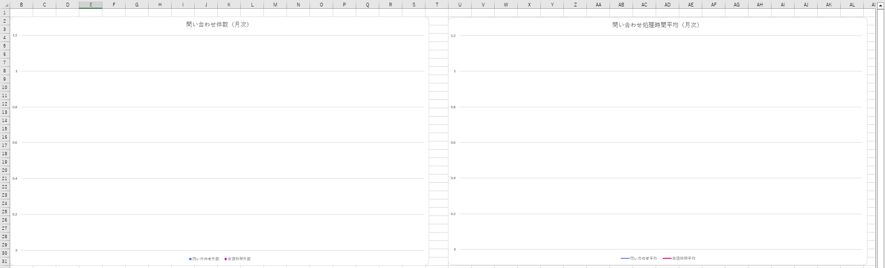
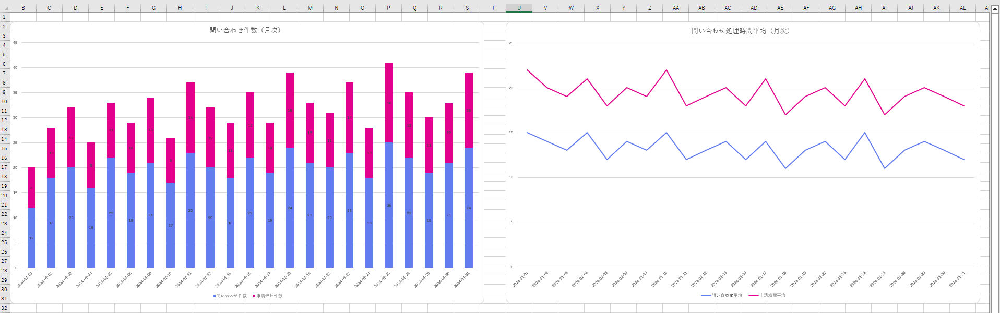

# Python Excelグラフ更新スクリプト

## 📌 概要
CSVファイルを日次単位で集計し、既存のExcelファイルに転記するスクリプトです。
Excelファイルにはグラフがあり、データ転記により自動的に最新状態へ反映されます。

## 📷 実行イメージ

**スクリプト実行前**


**スクリプト実行後**


---

## 🚀 特徴 / 機能
- **設定値を setting.json に集約し、環境変更に強い構成**  
  インプット・アウトプットの変更時もコード修正を最小限に抑えられる構成としています。

- **Excelをインストールせずに処理可能**  
  openpyxlを使用することでExcelがインストールされていない環境でも実行可能です。
  
- **入力・加工・出力を関数単位で分離**  
  メンテナンスがしやすいように主要な処理を関数単位で分離しています。

- **logファイルへのログ出力**  
  ログ出力を標準搭載し、運用時のトラブル調査を容易にする工夫をしています。

---

## 🛠 使用技術
- Python 3.13（※ 3.x 系で動作確認）
- pandas
- openpyxl
- logging
- JSON（設定管理）

## 🔄 処理概要（全体フロー）
  1．setting.json から各種設定を読み込み

  2．CSVファイルを pandas で読み込み

  3．日付 × カテゴリ単位でデータを集計

  4．集計結果を Excel ファイルの指定シートへ転記

  ※処理実行中は、処理状況・エラーをログとして出力

## 📂 ディレクトリ構成

```text
ExcelUpdateScript/
├─ images/
│  ├─ graph_before_update.png
│  └─ graph_after_update.png
├─ scripts/
│  ├─ main.py
│  ├─ config.py
│  ├─ logger.py
│  └─ common.py
├─ config/
│  └─ setting.json
├─ data/
│  ├─ in/
│  │  └─ sample_data.csv
│  └─ out/
│     └─ dashboard.xlsx
└─ logs/
   └─ app.log
```

---

## ▶ 使い方

```bash
python main.py
```

※pandas、openpyxlがインストールされていない場合、インストールしてください。

```bash
pip install pandas openpyxl
```

---

### 📊 入出力データ仕様（簡易）

**入力データ（sample_data.csv）**

| 列名               | 内容         |
| ---------------- | ---------- |
| date             | 日付         |
| category         | 問い合わせ / 申請 |
| count            | 件数         |
| avg_process_time | 平均処理時間     |

**出力データ（dashboard.xlsx）**

date単位で集約し、setting.jsonで指定したシートに出力する

| 列名            | 元データ        |
| ------------- | --------- |
| 日付      | sample_data.date     |
| 問い合わせ件数      | sample_data.count（categoryが「問い合わせ」） |
| 申請処理件数 | sample_data.count（categoryが「申請」）    |
| 問い合わせ平均      | sample_data.avg_process_time（categoryが「問い合わせ」） |
| 申請処理平均 | sample_data.avg_process_time（categoryが「申請」）    |

---

### 🎯 背景・解決した課題

- **手作業でのデータ集計、Excel転記を自動化**

- **Excelがインストールされていない環境でも実行できる**

---

## 📝 ライセンス

This project is licensed under the MIT License.

You are free to use, modify, and distribute this script for personal or commercial purposes.

※ 本スクリプトは MIT License のもとで公開されています。
商用・非商用を問わず、自由に利用・改変・再配布が可能です。

